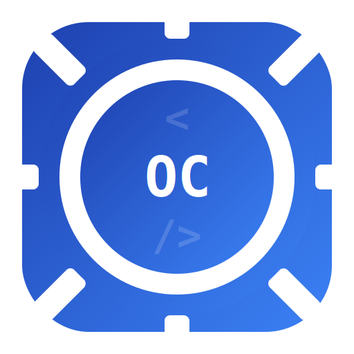

<div align="center">



# OpenCode Config

### OpenCode 全局配置管理器

<p>


</p>

</div>

## 为什么需要 OpenCode Config？

OpenCode 依赖 `~/.config/opencode/opencode.json` 管理模型提供商、MCP 服务器、权限规则等配置。每次更换 API 提供商或调整工具权限都需要手动编辑 JSON，格式稍有差错就会导致配置失效。

**OpenCode Config** 提供一个可视化桌面界面，让你无需手写 JSON 即可管理 OpenCode 的全部配置。左侧导航切换配置分类，右侧表单直接编辑，保存时自动备份，配置修改清晰可控。

- **图形化配置编辑器** — 左侧树形导航 + 右侧表单，告别手写 JSON
- **模型提供商管理** — 管理多个 AI 提供商和模型，baseURL / apiKey 独立填写
- **MCP 服务器管理** — 添加、启用/禁用本地/远程 MCP 服务器
- **权限规则可视化开关** — 每个工具权限（bash、edit、write 等）独立开关
- **自定义命令编排** — 管理 `/command` 指令模板
- **自动备份 + 一键恢复** — 保存时自动备份，保留最近 2 份
- **跨平台** — Windows / macOS / Linux，Wails 2 构建的原生桌面应用

### 提供商管理

- 模型提供商增删改查，名称 / NPM 包 / baseURL / apiKey 独立字段
- 每个提供商可管理多个模型（模型 ID + 显示名称）
- 内置 options 编辑器，支持任意扩展字段（thinking、limit 等）

### 工具权限

- 14 项权限开关（bash、edit、glob、grep、read、write、webfetch 等）
- 绿色 = 允许（allow），灰色 = 拒绝（deny）
- 即时生效，保存后重启 OpenCode 即可应用

### MCP 服务器

- 本地服务器：配置命令（如 `npx chrome-devtools-mcp`）
- 远程服务器：配置 URL（如 `https://mcp.context7.com/mcp`）
- 启用/禁用开关，一键删除

### 自定义命令

- 管理 OpenCode 的 `command` 配置段
- 每个命令包含描述和模板，支持多行编辑

### 备份管理

- 保存配置时自动创建时间戳备份
- 只保留最近 2 个备份，避免堆积
- 一键从备份恢复

## 快速开始

1. **启动应用**：运行 `opencode-config` 或在命令行执行 `wails dev`
2. **浏览配置**：左侧导航选择要编辑的分类（模型 / MCP / 权限等）
3. **修改保存**：右侧表单编辑完成后，点击左下角「保存更改」
4. **重启生效**：保存后需要重启 OpenCode 才能使新配置生效

### 备份恢复

- 切换到「备份管理」面板，查看现有备份
- 点击「恢复此备份」即可回到该版本

## 开发与构建

```bash
# 开发模式（HMR + Go 热重载）
wails dev

# 浏览器开发（无需桌面窗口）
# 访问 http://localhost:34115，Go 方法可从 DevTools 调用

# 生产构建
wails build
```

### 技术栈

| 层 | 技术 |
|---|---|
| 后端 | Go 1.23 + Wails v2.12 |
| 前端 | React 18 + Vite 3 + Flowbite (Tailwind CSS) |
| 构建 | wails build → 单文件 exe |

## 配置说明

- **配置文件路径**：`~/.config/opencode/opencode.json`
- **备份文件命名**：`opencode.json.backup.YYYYMMDD-HHMMSS`
- **备份保留策略**：最近 2 个备份
